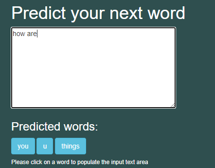
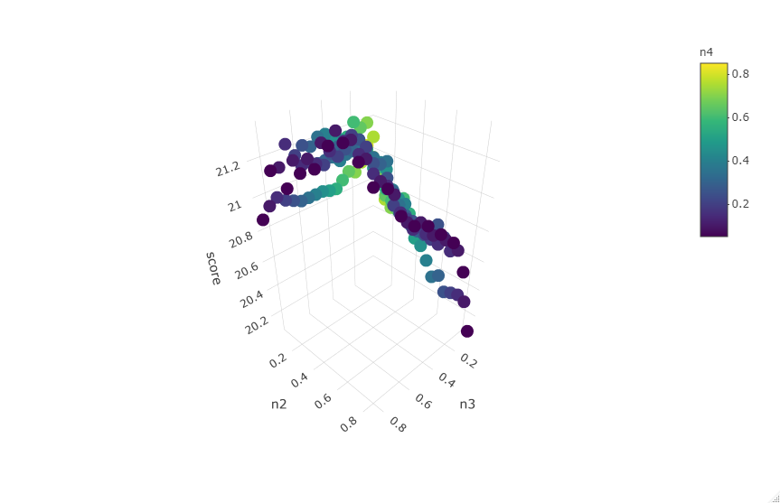

Text Predictor Overview
================
Brandon Clark
8/9/2020

# Text Predictor Algorithm and Web App

Please find web app:
<https://bclark94.shinyapps.io/NextWordPredictorWebApp/>



Techniques used: Natural Language Processing, N grams, Markov Chains,
Optimization modeling, Cross Validation, machine learning

All Development completed in R. Web App created with R Shiny and hosted
on shinyapps.io

## Introduction

This project was initially created for the capstone project of the Data
Science Specialization offered through Coursera and Johns Hopkins
University. SwiftKey participated as a corporate partner for the course
capstone project

3 large corpora were provided with text from News articles, Blogs, and
Tweets. I constructed an alogithm to return a prediction of the next
word given input text from the user

## Development Overview

1.  Load and sample copora to workable sized dataset
2.  Preprocess and clean corpora
3.  Exploratory Analysis
4.  Build nGram dictionaries
5.  Build prediction algorithm
6.  Optimize and Test
7.  Build Web App

### 1a. Load Corpora

``` r
library(tm)
library(dplyr)
library(wordcloud)
library(textreg)
library(quanteda)

blogsFile <- file( './datasets/en_US/en_US.blogs.txt' , open = "rb")
en_US.blogs = readLines( blogsFile, encoding = "UTF-8", skipNul=TRUE )

twitterFile <- file( './datasets/en_US/en_US.twitter.txt' , open = "rb" )
en_US.twitter = readLines( twitterFile, encoding = "UTF-8", skipNul=TRUE )

newsFile <- file( './datasets/en_US/en_US.news.txt' , open = "rb")
en_US.news = readLines( newsFile, encoding = "UTF-8", skipNul=TRUE)

#remove non eneglish characters
en_US.blogs <- iconv(en_US.blogs, "latin1", "ASCII", sub="")
en_US.twitter<- iconv(en_US.twitter, "latin1", "ASCII", sub="")
en_US.news <- iconv(en_US.news, "latin1", "ASCII", sub="")
```

Lines and Word counts in each corpus before preprocessing and cleaining

``` r
f.word.count <- function(my.list) { sum(stringr::str_count(my.list, "\\S+")) }
list <- list(blog = en_US.blogs , twitter = en_US.twitter, news = en_US.news)

df <- data.frame(source = c("blog", "twitter", "news"), line.count = NA, word.count = NA)

df$line.count <- sapply(list, length)
df$word.count <- sapply(list, f.word.count)

par(mfrow=c(1,2))
barplot(height = df$line.count, names.arg = df$source , ylab = 'line count')
barplot(height = df$word.count, names.arg = df$source , ylab = 'word count')
```


### 1b. Sample Corpora

Use binomial sampling to get random 5% sample of data

``` r
percent <- 0.05

sampleFunction <- function(data, percent)
{
  return(data[as.logical(rbinom(length(data),2,percent))])
}

en_US.blogs   <- sampleFunction(en_US.blogs, percent)
en_US.twitter   <- sampleFunction(en_US.twitter, percent)
en_US.news   <- sampleFunction(en_US.news, percent)

allSources<-c(en_US.blogs,en_US.twitter,en_US.news)
```

### 2\. Preprocess and clean corpora

Each corpus will have punction, non ASCII characters, whitespace, and
numbers removed. All text will be converted to lower case

Example for news datasource:

``` r
#news
en_US.newsCleaned <- en_US.newsCorp
en_US.newsCleaned <- tm_map(en_US.newsCleaned, removePunctuation)  
en_US.newsCleaned <- tm_map(en_US.newsCleaned, toSpace, "(f|ht)tp(s?)://(.*)[.][a-z]+")
en_US.newsCleaned <- tm_map(en_US.newsCleaned, toSpace, "@[^\\s]+")
en_US.newsCleaned <- tm_map(en_US.newsCleaned, removeNumbers)     
en_US.newsCleaned <- tm_map(en_US.newsCleaned, tolower)     
#en_US.newsCleaned <- tm_map(en_US.newsCleaned, removeWords, stopwords("english"))  
en_US.newsCleaned <- tm_map(en_US.newsCleaned, stripWhitespace)   

newsDfm <- dfm(corpus(en_US.newsCleaned), verbose = FALSE)
newsD <- textstat_frequency(newsDfm)
colnames(newsD) <- c('word','newsFreq','newsRank')
newsD<-newsD[,1:3]
```

### 3\. Exploratory Analysis

Top Words:

``` r
allSourcesDF <- allSourcesD
allSourcesDF <- left_join(allSourcesD, blogsD, by = 'word')
allSourcesDF <- left_join(allSourcesDF, newsD, by = 'word')
allSourcesDF <- left_join(allSourcesDF, twitterD, by = 'word')
head(allSourcesDF, n = 20)
```

    ##    word allSourcesFreq allSourcesrank blogsFreq blogsRank newsFreq newsRank
    ## 1   the         462904              1    179874         1   191789        1
    ## 2    to         268108              2    103343         3    87515        2
    ## 3   and         233712              3    105253         2    86031        3
    ## 4     a         231464              4     86669         4    85673        4
    ## 5    of         194882              5     84958         5    75284        5
    ## 6    in         159927              6     57217         7    66010        6
    ## 7     i         158786              7     74331         6    15214       19
    ## 8   for         107150              8     35456        11    34193        7
    ## 9    is         104094              9     41799         9    27520        9
    ## 10 that         101025             10     44289         8    33902        8
    ## 11  you          90895             11     28725        12     9178       36
    ## 12   it          88659             12     38874        10    21314       15
    ## 13   on          79903             13     26648        15    26193       10
    ## 14 with          69230             14     27886        13    24642       11
    ## 15  was          60508             15     26692        14    22401       14
    ## 16   my          58792             16     26292        16     4077       80
    ## 17   at          55422             17     16820        24    20817       16
    ## 18   be          53537             18     20130        20    14925       20
    ## 19 this          52884             19     25133        17    11894       28
    ## 20 have          51969             20     21486        18    14030       23
    ##    twitterFreq twitterRank
    ## 1        91241           1
    ## 2        77250           2
    ## 3        42428           6
    ## 4        59122           4
    ## 5        34640          10
    ## 6        36700           8
    ## 7        69241           3
    ## 8        37501           7
    ## 9        34775           9
    ## 10       22834          14
    ## 11       52992           5
    ## 12       28471          11
    ## 13       27062          13
    ## 14       16702          18
    ## 15       11415          32
    ## 16       28423          12
    ## 17       17785          17
    ## 18       18482          16
    ## 19       15857          22
    ## 20       16453          20

The below plot shows that there is an extremely long tail of words in
the corpus. This indicates that there can be relatively strong
prediction accuracy without having to be able predict distinct every
word.

This is good news - the memory requirements to be able to predict
hundreds of thousands of words is not practical


### 4\. Build nGram Dictionaries

nGram dictionaries will be created as the core of the prediction engine.
An nGram is commonly occuring string of n words. For example, a 3-gram
would be used to predict the 3rd word for a string of 2 words.

Example for news:

``` r
#News
unigram.tokenizer <- ngram_tokenizer(1)
wordlist <- unigram.tokenizer(as.character(en_US.newsCleaned))
unigram.df <- data.frame(V1 = as.vector(names(table(unlist(wordlist)))), V2 = as.numeric(table(unlist(wordlist))))
unigram.df <- unigram.df[which(unigram.df$V2 > 1),]
names(unigram.df) <- c("word","newsFreq")
row.names(unigram.df) <- NULL
newsUnigram.df <- unigram.df[with(unigram.df, order(-unigram.df$newsFreq)),]


bigram.tokenizer <- ngram_tokenizer(2)
wordlist <- bigram.tokenizer(as.character(en_US.newsCleaned))
bigram.df <- data.frame(V1 = as.vector(names(table(unlist(wordlist)))), V2 = as.numeric(table(unlist(wordlist))))
bigram.df <- bigram.df[which(bigram.df$V2 > 1),]
names(bigram.df) <- c("word","newsFreq")
row.names(unigram.df) <- NULL
newsBigram.df <- bigram.df[with(bigram.df, order(-bigram.df$newsFreq)),]

trigram.tokenizer <- ngram_tokenizer(3)
wordlist <- trigram.tokenizer(as.character(en_US.newsCleaned))
trigram.df <- data.frame(V1 = as.vector(names(table(unlist(wordlist)))), V2 = as.numeric(table(unlist(wordlist))))
trigram.df <- trigram.df[which(trigram.df$V2 > 1),]
names(trigram.df) <- c("word","newsFreq")
row.names(trigram.df) <- NULL
newsTrigram.df <- trigram.df[with(trigram.df, order(-trigram.df$newsFreq)),]

quadgram.tokenizer <- ngram_tokenizer(4)
wordlist <- quadgram.tokenizer(as.character(en_US.newsCleaned))
quadgram.df <- data.frame(V1 = as.vector(names(table(unlist(wordlist)))), V2 = as.numeric(table(unlist(wordlist))))
quadgram.df <- quadgram.df[which(quadgram.df$V2 > 1),]
names(quadgram.df) <- c("word","newsFreq")
row.names(quadgram.df) <- NULL
newsQuadgram.df <- quadgram.df[with(quadgram.df, order(-quadgram.df$newsFreq)),]
```

Create dataframes to be used in prediction algorithm. Example for
quadgrams:

``` r
head(quadgram.df)
```

    ##        X                  word blogsFreq newsFreq twitterFreq    blogsProp
    ## 1  99892        the end of the       327      306         140 0.0009237549
    ## 2 104101       the rest of the       342      200         132 0.0009661290
    ## 3  16291         at the end of       286      262         104 0.0008079324
    ## 4 241975 thanks for the follow        NA       NA         577           NA
    ## 5  32774    for the first time       187      253         167 0.0005282635
    ## 6  16461      at the same time       215      169         106 0.0006073618
    ##       newsProp  twitterProp weightedProp          ngram newWord stopWord
    ## 1 0.0011056311 0.0005095912 0.0008463258     the end of     the        Y
    ## 2 0.0007226347 0.0004804717 0.0007230785    the rest of     the        Y
    ## 3 0.0009466515 0.0003785535 0.0007110458     at the end      of        Y
    ## 4           NA 0.0021002439 0.0007000813 thanks for the  follow        N
    ## 5 0.0009141329 0.0006078695 0.0006834220  for the first    time        N
    ## 6 0.0006106263 0.0003858334 0.0005346072    at the same    time        N

### 5\. Build prediction algorithm

The full algorithm can be found in nextWordPredictor.R.

The algorithm takes input text and returns 3 candidates for next word.
It will take the input text and use the bigram dictionary to create
predictions using just the last 1 word, trigram predictions using last 2
words, and quadgram predictions using the last 3 words. A unigram
prediction is provided based on the top occuring words.

For each candidate and set of ngram predictions, a probability is
calculated using the occurences of the n gram for the prediction divided
by the sum of frequencies of all predictions in the ngram dictionary.
These probabilities are then multiplied by a set of weights (optimized
below). The weighted probabilities are then summed and the top 3
predictions are provided by the algorithm.

This can mathematically represented by:   
 = & \\lambda_0 P(w_n) + \\\\
& \\lambda_1 P(w_n|w_{n-1}) + \\\\
& \\lambda_2 P(w_n|w_{n-1},w_{n-2})+ \\\\
& \\lambda_3 P(w_n|w_{n-1},w_{n-2},w_{n-3})
\\end{align*} ")  

Where the set of weights =   
  

### 6\. Optimize and Test

I decided to optimize for prediction accuracy where predediction
accuracy = % of text inputs where one of the 3 predictions was the
actual next word.

I adapted the benchmarking function from
<https://github.com/hfoffani/dsci-benchmark>

The full benchmark and optimization code can be found in
benchmarkOptimize.R

The optimization engine is finding the top permutation of weights to be
used in the alogrithm. In order to reduce the number of tests to be
performed, I found all permutations of weights where unigram weight \<=
.1 and sum of weights = 1.

``` r
library(RcppAlgos)
weights <- permuteGeneral(20,4, repetition = TRUE, constraintFun = "sum",comparisonFun = "==", limitConstraints = 20)
weights <- data.frame(weights)
weights <- weights/20
colnames(weights) <- c('n1','n2','n3','n4')
weights <- weights[which(weights$n1<=.1), ]
head(weights)
```

    ##     n1   n2   n3   n4
    ## 1 0.05 0.05 0.05 0.85
    ## 2 0.05 0.05 0.85 0.05
    ## 3 0.05 0.85 0.05 0.05
    ## 5 0.05 0.05 0.10 0.80
    ## 6 0.05 0.05 0.80 0.10
    ## 7 0.05 0.10 0.05 0.80

Optimization mathematical representation:   
 \\\\
s.t. \\lambda_0 + \\lambda_1 + \\lambda_2 + \\lambda_3 = 1 \\\\
\\lambda_0,\\lambda_1,\\lambda_2,\\lambda_3 \\ge .05   \\\\
\\lambda_0 \\le .1 \\\\
\\end{align*}")  

Data is then divieded in test and training sets to be ran though the
benchmark function for each set of weights:

``` r
#create test and training datasets
set.seed(1017)
tweetSamp <- sample(length(tweets),100 )
blogsSamp <- sample(length(blogs),100 )

tweets <- tweets[tweetSamp]
blogs <- blogs[blogsSamp]

tweetsTrainInd <- sample(length(tweets),80 )
blogsTrainInd <- sample(length(blogs),80 )

tweetsTrain <- tweets[tweetsTrainInd]
blogsTrain <- blogs[blogsTrainInd]

tweetsTest <- tweets[-tweetsTrainInd]
blogsTest <- blogs[-blogsTrainInd]
```

The optimal set of weights after training and cross validation of the
test data:

  
 ")  

A graphical illustration (holding lambda0 = 0.5)
<https://bclark94.shinyapps.io/NextWordPredictorWebApp/>
 This 3d plot
shows that the prediction score peaks at 21.3% for the optimal weights.
The plot shows clear decline in accuracy where n2 (bigram weight) is
large.

### 7\. Build Web App

The model is deployed with an R Shiny application using shinyapps.io


Please try the app\!
<https://bclark94.shinyapps.io/NextWordPredictorWebApp/>
