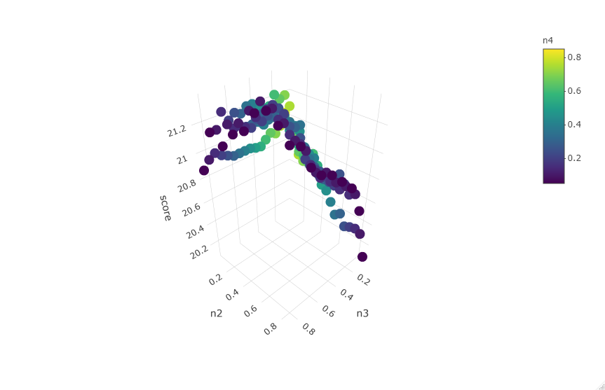

# Text Predictor Algorithm and Web App

Please find web app: https://bclark94.shinyapps.io/NextWordPredictorWebApp/

Techniques used: Natural Language Processing, N grams, Markov Chains, Optimization modeling, Cross Validation, machine learning

All Development completed in R.  Web App created with R Shiny and hosted on shinyapps.io

## Introduction
This project was initially created for the capstone project of the Data Science Specialization offered through Coursera and Johns Hopkins University.  SwiftKey participated as a corporate partner for the course capstone project

3 large corpora were provided with text from News articles, Blogs, and Tweets.  I constructed an alogithm to return a prediction of the next word given input text from the user

## Development Overview
1. Load and sample copora to workable sized dataset 
2. Preprocess and clean corpora
3. Exploratory Analysis
4. Build nGram dictionaries
5. Build prediction algorithm
6. Optimize and Test
7. Build Web App

```{r warning=FALSE, echo = FALSE, message = FALSE}
library(tm)
library(dplyr)
library(wordcloud)
library(textreg)
library(quanteda)
library(stringr)

#curDir = 'C:/Users/bclar/OneDrive/Documents/Data Science Specialization/10 - Capstone Project'
#setwd(curDir)
```

### 1a. Load Corpora
```{r warning=FALSE}
library(tm)
library(dplyr)
library(wordcloud)
library(textreg)
library(quanteda)

blogsFile <- file( './datasets/en_US/en_US.blogs.txt' , open = "rb")
en_US.blogs = readLines( blogsFile, encoding = "UTF-8", skipNul=TRUE )

twitterFile <- file( './datasets/en_US/en_US.twitter.txt' , open = "rb" )
en_US.twitter = readLines( twitterFile, encoding = "UTF-8", skipNul=TRUE )

newsFile <- file( './datasets/en_US/en_US.news.txt' , open = "rb")
en_US.news = readLines( newsFile, encoding = "UTF-8", skipNul=TRUE)

#remove non eneglish characters
en_US.blogs <- iconv(en_US.blogs, "latin1", "ASCII", sub="")
en_US.twitter<- iconv(en_US.twitter, "latin1", "ASCII", sub="")
en_US.news <- iconv(en_US.news, "latin1", "ASCII", sub="")
```

Lines and Word counts in each corpus before preprocessing and cleaining
```{r warning=FALSE}
f.word.count <- function(my.list) { sum(stringr::str_count(my.list, "\\S+")) }
list <- list(blog = en_US.blogs , twitter = en_US.twitter, news = en_US.news)

df <- data.frame(source = c("blog", "twitter", "news"), line.count = NA, word.count = NA)

df$line.count <- sapply(list, length)
df$word.count <- sapply(list, f.word.count)

par(mfrow=c(1,2))
barplot(height = df$line.count, names.arg = df$source , ylab = 'line count')
barplot(height = df$word.count, names.arg = df$source , ylab = 'word count')
```


### 1b. Sample Corpora
Use binomial sampling to get random 5% sample of data
```{r warning=FALSE}
percent <- 0.05

sampleFunction <- function(data, percent)
{
  return(data[as.logical(rbinom(length(data),2,percent))])
}

en_US.blogs   <- sampleFunction(en_US.blogs, percent)
en_US.twitter   <- sampleFunction(en_US.twitter, percent)
en_US.news   <- sampleFunction(en_US.news, percent)

allSources<-c(en_US.blogs,en_US.twitter,en_US.news)
```

### 2. Preprocess and clean corpora
Each corpus will have punction, non ASCII characters, whitespace, and numbers removed.  All text will be converted to lower case
```{r warning=FALSE, echo = FALSE}
en_US.blogsCorp <- Corpus(VectorSource(en_US.blogs))
en_US.twitterCorp <- Corpus(VectorSource(en_US.twitter))
en_US.newsCorp <- Corpus(VectorSource(en_US.news))
allSourcesCorp <- Corpus(VectorSource(allSources))

toSpace <- content_transformer(function(x, pattern) gsub(pattern, " ", x))

allSourcesCorpCleaned <- allSourcesCorp
allSourcesCorpCleaned <- tm_map(allSourcesCorpCleaned, removePunctuation) 
allSourcesCorpCleaned <- tm_map(allSourcesCorpCleaned, toSpace, "(f|ht)tp(s?)://(.*)[.][a-z]+")
allSourcesCorpCleaned <- tm_map(allSourcesCorpCleaned, toSpace, "@[^\\s]+")
allSourcesCorpCleaned <- tm_map(allSourcesCorpCleaned, removeNumbers)     
allSourcesCorpCleaned <- tm_map(allSourcesCorpCleaned, tolower)     
#allSourcesCorpCleaned <- tm_map(allSourcesCorpCleaned, removeWords, stopwords("english"))  
allSourcesCorpCleaned <- tm_map(allSourcesCorpCleaned, stripWhitespace)   

allSourcesDfm <- dfm(corpus(allSourcesCorpCleaned), verbose = FALSE)
allSourcesD <- textstat_frequency(allSourcesDfm)
colnames(allSourcesD) <- c('word','allSourcesFreq','allSourcesrank')
allSourcesD<-allSourcesD[,1:3]


#blogs
en_US.blogsCleaned <- en_US.blogsCorp
en_US.blogsCleaned <- tm_map(en_US.blogsCleaned, removePunctuation)  
en_US.blogsCleaned <- tm_map(en_US.blogsCleaned, toSpace, "(f|ht)tp(s?)://(.*)[.][a-z]+")
en_US.blogsCleaned <- tm_map(en_US.blogsCleaned, toSpace, "@[^\\s]+")
en_US.blogsCleaned <- tm_map(en_US.blogsCleaned, removeNumbers)     
en_US.blogsCleaned <- tm_map(en_US.blogsCleaned, tolower)     
#en_US.blogsCleaned <- tm_map(en_US.blogsCleaned, removeWords, stopwords("english"))  
en_US.blogsCleaned <- tm_map(en_US.blogsCleaned, stripWhitespace)   

blogsDfm <- dfm(corpus(en_US.blogsCleaned), verbose = FALSE)
blogsD <- textstat_frequency(blogsDfm)
colnames(blogsD) <- c('word','blogsFreq','blogsRank')
blogsD<-blogsD[,1:3]

#twitter
en_US.twitterCleaned <- en_US.twitterCorp
en_US.twitterCleaned <- tm_map(en_US.twitterCleaned, removePunctuation)  
en_US.twitterCleaned <- tm_map(en_US.twitterCleaned, toSpace, "(f|ht)tp(s?)://(.*)[.][a-z]+")
en_US.twitterCleaned <- tm_map(en_US.twitterCleaned, toSpace, "@[^\\s]+")
en_US.twitterCleaned <- tm_map(en_US.twitterCleaned, removeNumbers)     
en_US.twitterCleaned <- tm_map(en_US.twitterCleaned, tolower)     
#en_US.twitterCleaned <- tm_map(en_US.twitterCleaned, removeWords, stopwords("english"))  
en_US.twitterCleaned <- tm_map(en_US.twitterCleaned, stripWhitespace) 

twitterDfm <- dfm(corpus(en_US.twitterCleaned), verbose = FALSE)
twitterD <- textstat_frequency(twitterDfm)
colnames(twitterD) <- c('word','twitterFreq','twitterRank')
twitterD<-twitterD[,1:3]
```
Example for news datasource:
```{r warning=FALSE}
#news
en_US.newsCleaned <- en_US.newsCorp
en_US.newsCleaned <- tm_map(en_US.newsCleaned, removePunctuation)  
en_US.newsCleaned <- tm_map(en_US.newsCleaned, toSpace, "(f|ht)tp(s?)://(.*)[.][a-z]+")
en_US.newsCleaned <- tm_map(en_US.newsCleaned, toSpace, "@[^\\s]+")
en_US.newsCleaned <- tm_map(en_US.newsCleaned, removeNumbers)     
en_US.newsCleaned <- tm_map(en_US.newsCleaned, tolower)     
#en_US.newsCleaned <- tm_map(en_US.newsCleaned, removeWords, stopwords("english"))  
en_US.newsCleaned <- tm_map(en_US.newsCleaned, stripWhitespace)   

newsDfm <- dfm(corpus(en_US.newsCleaned), verbose = FALSE)
newsD <- textstat_frequency(newsDfm)
colnames(newsD) <- c('word','newsFreq','newsRank')
newsD<-newsD[,1:3]
```

### 3. Exploratory Analysis

Top Words:
```{r warning=FALSE}
allSourcesDF <- allSourcesD
allSourcesDF <- left_join(allSourcesD, blogsD, by = 'word')
allSourcesDF <- left_join(allSourcesDF, newsD, by = 'word')
allSourcesDF <- left_join(allSourcesDF, twitterD, by = 'word')
head(allSourcesDF, n = 20)
```

The below plot shows that there is an extremely long tail of words in the corpus.  This indicates that there can be relatively strong prediction accuracy without having to be able predict distinct every word.

This is good news - the memory requirements to be able to predict hundreds of thousands of words is not practical
```{r warning=FALSE}
allSourcesDF$cumProportion <- cumsum( allSourcesDF$allSourcesFreq )/sum(allSourcesDF$allSourcesFreq )

#par(mfrow=c(2,2))
plot1 <-plot( seq.int(nrow(allSourcesDF)) , cumsum( allSourcesDF$allSourcesFreq )/sum(allSourcesDF$allSourcesFreq ),
              xlab = "Distinct Word Count", ylab = "Cumulative Proportion", 
              main = "All Data Sources: Ordered Word Count, Cumulative Sum/Total Word Count") +
  abline(h = .9, col = "red", lty = 2, cex =  2) +
  abline(h = .5, col = "blue", lty = 2, cex = 2) +
  abline(v=nrow(allSourcesDF) , col = "green", lty = 2, cex = 2) +
  abline(v = nrow(allSourcesDF[which(allSourcesDF$cumProportion < .5),]), col = "blue", lty = 2, cex = 2) +
  abline(v = nrow(allSourcesDF[which(allSourcesDF$cumProportion < .9),]), col = "red", lty = 2, cex = 2) +
  text(x=0,y=.53, "50%", col = "blue", cex = 1) +
  text(x=0,y=.93, "90%", col = "red", cex = 1) +
  text(x=nrow(allSourcesDF[which(allSourcesDF$cumProportion < .9),]),y=0, nrow(allSourcesDF[which(allSourcesDF$cumProportion < .9),]), col = "red", cex = 1) +
  text(x=nrow(allSourcesDF[which(allSourcesDF$cumProportion < .5),]),y=0, nrow(allSourcesDF[which(allSourcesDF$cumProportion < .5),]), col = "blue", cex = 1) +
  text(x=nrow(allSourcesDF),y=0, nrow(allSourcesDF), col = "green", cex = 1) 
plot1
```

### 4. Build nGram Dictionaries

nGram dictionaries will be created as the core of the prediction engine.  An nGram is commonly occuring string of n words.  For example, a 3-gram would be used to predict the 3rd word for a string of 2 words.

```{r warning=FALSE, eval = FALSE}
source("Ngrams_tokenizer.R")
unigram.tokenizer <- ngram_tokenizer(1)
wordlist <- unigram.tokenizer(as.character(en_US.blogsCleaned))
unigram.df <- data.frame(V1 = as.vector(names(table(unlist(wordlist)))), V2 = as.numeric(table(unlist(wordlist))))
unigram.df <- unigram.df[which(unigram.df$V2 > 1),]
names(unigram.df) <- c("word","blogsFreq")
row.names(unigram.df) <- NULL
blogsUnigram.df <- unigram.df[with(unigram.df, order(-unigram.df$blogsFreq)),]


bigram.tokenizer <- ngram_tokenizer(2)
wordlist <- bigram.tokenizer(as.character(en_US.blogsCleaned))
bigram.df <- data.frame(V1 = as.vector(names(table(unlist(wordlist)))), V2 = as.numeric(table(unlist(wordlist))))
bigram.df <- bigram.df[which(bigram.df$V2 > 1),]
names(bigram.df) <- c("word","blogsFreq")
row.names(unigram.df) <- NULL
blogsBigram.df <- bigram.df[with(bigram.df, order(-bigram.df$blogsFreq)),]

trigram.tokenizer <- ngram_tokenizer(3)
wordlist <- trigram.tokenizer(as.character(en_US.blogsCleaned))
trigram.df <- data.frame(V1 = as.vector(names(table(unlist(wordlist)))), V2 = as.numeric(table(unlist(wordlist))))
trigram.df <- trigram.df[which(trigram.df$V2 > 1),]
names(trigram.df) <- c("word","blogsFreq")
row.names(trigram.df) <- NULL
blogsTrigram.df <- trigram.df[with(trigram.df, order(-trigram.df$blogsFreq)),]

quadgram.tokenizer <- ngram_tokenizer(4)
wordlist <- quadgram.tokenizer(as.character(en_US.blogsCleaned))
quadgram.df <- data.frame(V1 = as.vector(names(table(unlist(wordlist)))), V2 = as.numeric(table(unlist(wordlist))))
quadgram.df <- quadgram.df[which(quadgram.df$V2 > 1),]
names(quadgram.df) <- c("word","blogsFreq")
row.names(quadgram.df) <- NULL
blogsQuadgram.df <- quadgram.df[with(quadgram.df, order(-quadgram.df$blogsFreq)),]
```
Example for news:
```{r warning=FALSE, eval = FALSE}
#News
unigram.tokenizer <- ngram_tokenizer(1)
wordlist <- unigram.tokenizer(as.character(en_US.newsCleaned))
unigram.df <- data.frame(V1 = as.vector(names(table(unlist(wordlist)))), V2 = as.numeric(table(unlist(wordlist))))
unigram.df <- unigram.df[which(unigram.df$V2 > 1),]
names(unigram.df) <- c("word","newsFreq")
row.names(unigram.df) <- NULL
newsUnigram.df <- unigram.df[with(unigram.df, order(-unigram.df$newsFreq)),]


bigram.tokenizer <- ngram_tokenizer(2)
wordlist <- bigram.tokenizer(as.character(en_US.newsCleaned))
bigram.df <- data.frame(V1 = as.vector(names(table(unlist(wordlist)))), V2 = as.numeric(table(unlist(wordlist))))
bigram.df <- bigram.df[which(bigram.df$V2 > 1),]
names(bigram.df) <- c("word","newsFreq")
row.names(unigram.df) <- NULL
newsBigram.df <- bigram.df[with(bigram.df, order(-bigram.df$newsFreq)),]

trigram.tokenizer <- ngram_tokenizer(3)
wordlist <- trigram.tokenizer(as.character(en_US.newsCleaned))
trigram.df <- data.frame(V1 = as.vector(names(table(unlist(wordlist)))), V2 = as.numeric(table(unlist(wordlist))))
trigram.df <- trigram.df[which(trigram.df$V2 > 1),]
names(trigram.df) <- c("word","newsFreq")
row.names(trigram.df) <- NULL
newsTrigram.df <- trigram.df[with(trigram.df, order(-trigram.df$newsFreq)),]

quadgram.tokenizer <- ngram_tokenizer(4)
wordlist <- quadgram.tokenizer(as.character(en_US.newsCleaned))
quadgram.df <- data.frame(V1 = as.vector(names(table(unlist(wordlist)))), V2 = as.numeric(table(unlist(wordlist))))
quadgram.df <- quadgram.df[which(quadgram.df$V2 > 1),]
names(quadgram.df) <- c("word","newsFreq")
row.names(quadgram.df) <- NULL
newsQuadgram.df <- quadgram.df[with(quadgram.df, order(-quadgram.df$newsFreq)),]
```

```{r warning=FALSE, echo = FALSE, eval = FALSE}
#Twitter
unigram.tokenizer <- ngram_tokenizer(1)
wordlist <- unigram.tokenizer(as.character(en_US.twitterCleaned))
unigram.df <- data.frame(V1 = as.vector(names(table(unlist(wordlist)))), V2 = as.numeric(table(unlist(wordlist))))
unigram.df <- unigram.df[which(unigram.df$V2 > 1),]
names(unigram.df) <- c("word","twitterFreq")
row.names(unigram.df) <- NULL
twitterUnigram.df <- unigram.df[with(unigram.df, order(-unigram.df$twitterFreq)),]


bigram.tokenizer <- ngram_tokenizer(2)
wordlist <- bigram.tokenizer(as.character(en_US.twitterCleaned))
bigram.df <- data.frame(V1 = as.vector(names(table(unlist(wordlist)))), V2 = as.numeric(table(unlist(wordlist))))
bigram.df <- bigram.df[which(bigram.df$V2 > 1),]
names(bigram.df) <- c("word","twitterFreq")
row.names(unigram.df) <- NULL
twitterBigram.df <- bigram.df[with(bigram.df, order(-bigram.df$twitterFreq)),]

trigram.tokenizer <- ngram_tokenizer(3)
wordlist <- trigram.tokenizer(as.character(en_US.twitterCleaned))
trigram.df <- data.frame(V1 = as.vector(names(table(unlist(wordlist)))), V2 = as.numeric(table(unlist(wordlist))))
trigram.df <- trigram.df[which(trigram.df$V2 > 1),]
names(trigram.df) <- c("word","twitterFreq")
row.names(trigram.df) <- NULL
twitterTrigram.df <- trigram.df[with(trigram.df, order(-trigram.df$twitterFreq)),]

quadgram.tokenizer <- ngram_tokenizer(4)
wordlist <- quadgram.tokenizer(as.character(en_US.twitterCleaned))
quadgram.df <- data.frame(V1 = as.vector(names(table(unlist(wordlist)))), V2 = as.numeric(table(unlist(wordlist))))
quadgram.df <- quadgram.df[which(quadgram.df$V2 > 1),]
names(quadgram.df) <- c("word","twitterFreq")
row.names(quadgram.df) <- NULL
twitterQuadgram.df <- quadgram.df[with(quadgram.df, order(-quadgram.df$twitterFreq)),]

stopWords <- stopwords("english")

#create dataframe for each ngrams with frequencies

unigramDF <- merge(x = blogsUnigram.df, y = newsUnigram.df, by = "word", all = TRUE)
unigramDF <- merge(x = unigramDF, y = twitterUnigram.df, by = "word", all = TRUE)
blogsTot <- sum(unigramDF$blogsFreq,na.rm = TRUE)
unigramDF$blogsProp <- unigramDF$blogsFreq/blogsTot
newsTot <- sum(unigramDF$newsFreq,na.rm = TRUE)
unigramDF$newsProp <- unigramDF$newsFreq/newsTot
twitterTot <- sum(unigramDF$twitterFreq,na.rm = TRUE)
unigramDF$twitterProp <- unigramDF$twitterFreq/twitterTot
unigramDF$weightedProp <- rowSums(unigramDF[,c("blogsProp","newsProp","twitterProp")],na.rm=TRUE)/3
unigramDF <- unigramDF[order(-unigramDF$weightedProp),]
unigramDF$word <- trimws(unigramDF$word,which = 'both')
unigramDF$stopWord <- 'N'
index <- unigramDF$Word %in% stopWords
unigramDF$stopWord[index] <- "Y"

bigramDF <- merge(x = blogsBigram.df, y = newsBigram.df, by = "word", all = TRUE)
bigramDF <- merge(x = bigramDF, y = twitterBigram.df, by = "word", all = TRUE)
blogsTot <- sum(bigramDF$blogsFreq,na.rm = TRUE)
bigramDF$blogsProp <- bigramDF$blogsFreq/blogsTot
newsTot <- sum(bigramDF$newsFreq,na.rm = TRUE)
bigramDF$newsProp <- bigramDF$newsFreq/newsTot
twitterTot <- sum(bigramDF$twitterFreq,na.rm = TRUE)
bigramDF$twitterProp <- bigramDF$twitterFreq/twitterTot
bigramDF$weightedProp <- rowSums(bigramDF[,c("blogsProp","newsProp","twitterProp")],na.rm=TRUE)/3
bigramDF <- bigramDF[order(-bigramDF$weightedProp),]
bigramDF$word <- trimws(bigramDF$word,which = 'both')
bigramDF$ngram <- trimws(word(bigramDF$word,1,-2),which='both')
bigramDF$newWord <- trimws(word(bigramDF$word,-1),which='both')
bigramDF$stopWord <- 'N'
index <- bigramDF$newWord %in% stopWords
bigramDF$stopWord[index] <- "Y"


trigramDF <- merge(x = blogsTrigram.df, y = newsTrigram.df, by = "word", all = TRUE)
trigramDF <- merge(x = trigramDF, y = twitterTrigram.df, by = "word", all = TRUE)
blogsTot <- sum(trigramDF$blogsFreq,na.rm = TRUE)
trigramDF$blogsProp <- trigramDF$blogsFreq/blogsTot
newsTot <- sum(trigramDF$newsFreq,na.rm = TRUE)
trigramDF$newsProp <- trigramDF$newsFreq/newsTot
twitterTot <- sum(trigramDF$twitterFreq,na.rm = TRUE)
trigramDF$twitterProp <- trigramDF$twitterFreq/twitterTot
trigramDF$weightedProp <- rowSums(trigramDF[,c("blogsProp","newsProp","twitterProp")],na.rm=TRUE)/3
trigramDF <- trigramDF[order(-trigramDF$weightedProp),]
trigramDF$word <- trimws(trigramDF$word,which = 'both')
trigramDF$ngram <- trimws(word(trigramDF$word,1,-2),which='both')
trigramDF$newWord <- trimws(word(trigramDF$word,-1),which = 'both')
trigramDF$stopWord <- 'N'
index <- trigramDF$newWord %in% stopWords
trigramDF$stopWord[index] <- "Y"
```

Create dataframes to be used in prediction algorithm.  Example for quadgrams:
```{r warning=FALSE, eval = FALSE}

quadgramDF <- merge(x = blogsQuadgram.df, y = newsQuadgram.df, by = "word", all = TRUE)
quadgramDF <- merge(x = quadgramDF, y = twitterQuadgram.df, by = "word", all = TRUE)
blogsTot <- sum(quadgramDF$blogsFreq,na.rm = TRUE)
quadgramDF$blogsProp <- quadgramDF$blogsFreq/blogsTot
newsTot <- sum(quadgramDF$newsFreq,na.rm = TRUE)
quadgramDF$newsProp <- quadgramDF$newsFreq/newsTot
twitterTot <- sum(quadgramDF$twitterFreq,na.rm = TRUE)
quadgramDF$twitterProp <- quadgramDF$twitterFreq/twitterTot
quadgramDF$weightedProp <- rowSums(quadgramDF[,c("blogsProp","newsProp","twitterProp")],na.rm=TRUE)/3
quadgramDF <- quadgramDF[order(-quadgramDF$weightedProp),]
quadgramDF$word <- trimws(quadgramDF$word,which = 'both')
quadgramDF$ngram <- trimws(word(quadgramDF$word,1,-2),which = 'both')
quadgramDF$newWord <- trimws(word(quadgramDF$word,-1),which = 'both')
quadgramDF$stopWord <- 'N'
index <- quadgramDF$newWord %in% stopWords
quadgramDF$stopWord[index] <- "Y"
```

```{r warning=FALSE, echo = FALSE}
quadgram.df <- read.csv('./dictionaryData/quadgram.csv' )
```

```{r warning=FALSE}
head(quadgram.df)
```

### 5. Build prediction algorithm

The full algorithm can be found in nextWordPredictor.R.

The algorithm takes input text and returns 3 candidates for next word.  It will take the input text and use the bigram dictionary to create predictions using just the last 1 word, trigram predictions using last 2 words, and quadgram predictions using the last 3 words.  A unigram prediction is provided based on the top occuring words.  

For each candidate and set of ngram predictions, a probability is calculated using the occurences of the n gram for the prediction divided by the sum of frequencies of all predictions in the ngram dictionary.  These probabilities are then multiplied by a set of weights (optimized below).  The weighted probabilities are then summed and the top 3 predictions are provided by the algorithm.  

This can mathematically represented by:
$$ \begin{align*}
P(w_n|w_{n-1},w_{n-2},w_{n-3}) = & \lambda_0 P(w_n) + \\
& \lambda_1 P(w_n|w_{n-1}) + \\
& \lambda_2 P(w_n|w_{n-1},w_{n-2})+ \\
& \lambda_3 P(w_n|w_{n-1},w_{n-2},w_{n-3})
\end{align*} $$


Where the set of weights = $$ \begin{align*} \lambda_0,\lambda_1,\lambda_2,\lambda_3 \end{align*} $$


### 6. Optimize and Test

I decided to optimize for prediction accuracy where predediction accuracy = % of text inputs where one of the 3 predictions was the actual next word.

I adapted the benchmarking function from https://github.com/hfoffani/dsci-benchmark

The full benchmark and optimization code can be found in benchmarkOptimize.R

The optimization engine is finding the top permutation of weights to be used in the alogrithm.  In order to reduce the number of tests to be performed, I found all permutations of weights where unigram weight <= .1 and sum of weights = 1. 

```{r warning=FALSE}
library(RcppAlgos)
weights <- permuteGeneral(20,4, repetition = TRUE, constraintFun = "sum",comparisonFun = "==", limitConstraints = 20)
weights <- data.frame(weights)
weights <- weights/20
colnames(weights) <- c('n1','n2','n3','n4')
weights <- weights[which(weights$n1<=.1), ]
head(weights)
```

Optimization mathematical representation:
$$ \begin{align*}
max(PredictionAccuracy) \\
s.t. \lambda_0 + \lambda_1 + \lambda_2 + \lambda_3 = 1 \\
\lambda_0,\lambda_1,\lambda_2,\lambda_3 \ge .05   \\
\lambda_0 \le .1 \\
\end{align*}$$


Data is then divieded in test and training sets to be ran though the benchmark function for each set of weights:
```{r warning=FALSE, eval = FALSE}
#create test and training datasets
set.seed(1017)
tweetSamp <- sample(length(tweets),100 )
blogsSamp <- sample(length(blogs),100 )

tweets <- tweets[tweetSamp]
blogs <- blogs[blogsSamp]

tweetsTrainInd <- sample(length(tweets),80 )
blogsTrainInd <- sample(length(blogs),80 )

tweetsTrain <- tweets[tweetsTrainInd]
blogsTrain <- blogs[blogsTrainInd]

tweetsTest <- tweets[-tweetsTrainInd]
blogsTest <- blogs[-blogsTrainInd]
```


The optimal set of weights after training and cross validation of the test data:

$$\lambda_0,\lambda_1,\lambda_2,\lambda_3 = (0.05,0.3,0.55,0.1) $$

A graphical illustration (holding lambda0 = 0.5)
https://bclark94.shinyapps.io/NextWordPredictorWebApp/
```{r echo=FALSE, out.width='100%'}

```
This 3d plot shows that the prediction score peaks at 21.3% for the optimal weights.  The plot shows clear decline in accuracy where n2 (bigram weight) is large.

### 7. Build Web App

The model is deployed with an R Shiny application using shinyapps.io

```{r echo=FALSE, out.width='100%'}
knitr::include_graphics('./shinyApp.png')
```

Please try the app!
https://bclark94.shinyapps.io/NextWordPredictorWebApp/
